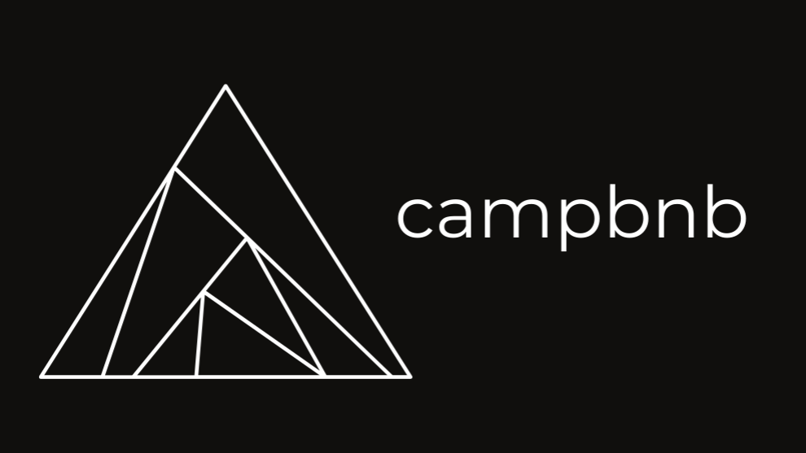

# CampBnB

 

## Table of Contents

- [Link to Live Site](https://github.com/willkee/CampBnB#link-to-live-site)
- [Description](https://github.com/willkee/CampBnB#description)
- [Technologies](https://github.com/willkee/CampBnB#technologies)
- [Getting Started](https://github.com/willkee/CampBnB#getting-started)
- [Features](https://github.com/willkee/CampBnB#features)
- [Screenshots](https://github.com/willkee/CampBnB#screenshots)
- [Future Development Ideas](https://github.com/willkee/CampBnB#future-development-ideas)

---

## Link to Live Site

[CampBnB Site](https://aa-campbnb.herokuapp.com/)

---

 

## Description

CampBnB is based off of AirBnB for users to list their spots or make bookings at existing spots on the platform. Spots may be edited or deleted by the owner of the spot as well. In a future development, users may also choose to leave a rating or review at any of the existing spots.

<b>In Progress: Improving responsiveness throughout website. UI modernization.</b>

 

## Technologies

 

  
  &nbsp;
  
  &nbsp;
  
  &nbsp;
  
  &nbsp;
  
  &nbsp;
  
  &nbsp;
  
  &nbsp;
  
  &nbsp;
  
  &nbsp;
  
  &nbsp;
  
  &nbsp;
  
  &nbsp;
  
  &nbsp;
  

 
 

## Getting Started

 

1.  Clone this repository:
            
         HTTPS: https://github.com/willkee/CampBnB.git
         
         or
         
         SSH: git@github.com:willkee/CampBnB.git

     

2.  Install dependencies from the root directory.

         npm install

     

3.  Create a user on PostgreSQL (psql) with a `PASSWORD` and `CREATEDB` privileges.

        CREATE USER <username> WITH PASSWORD <password> CREATEDB;

     

4.  In the backend directory, create a `.env` file based on the `.env.example` file.
     

5.  Enter your username and password into the respective fields in the `.env` file you just created. Enter your chosen database name and `PORT`. You may enter a secure combination of characters into `JWT_SECRET` or use the `require("crypto")` code below in `node` in your terminal to generate a secure string. You may use `localhost` for `DB_HOST`. 
    - require("crypto").randomBytes(32).toString("hex")
    - You may need to set up Google Maps API credentials [here](https://developers.google.com/maps/documentation/embed/get-api-key) to obtain an API key for the `MAPS_API_KEY`.
    - You may need to set up an Amazon Web Services (AWS) S3 account [here](https://aws.amazon.com/) to create a S3 bucket, and generate an AWS Access Key ID and AWS Secret Access Key.

        

     

6.  Add a number to `JWT_EXPIRES_IN`. By default, you may use `604500`.

 

7.  Ensure the following proxy code is found in your package.json file in the `frontend` directory. If you chose any port other than `5000`, replace the port number.

        "proxy": "http://localhost:5000"

     

8.  Run the following code in your backend directory to run the creation of the database and migrations as well as to seed the database.

        npx dotenv sequelize db:create
        npx dotenv sequelize db:migrate
        npx dotenv sequelize db:seed:all

     

9.  Start the backend and frontend servers in their respective directories. Your browser should open the application automatically. If not, navigate to `http://localhost:3000` in your browser.

        npm start

     

10. You may use the demo user or sign up as a new user to take advantage of the features of the application.

 

 

## Features

- There will be a splash page welcoming users to the site, with options to log in, sign up, log in as a demo user, or browse the site unauthenticated.
- The homepage will display a grid of spots already on the platform.
- Unauthenticated users may view (but not add) spots and associated reviews and ratings.
- Authenticated users may post a new spot, or a review/rating for an existing spot.

 

## Screenshots

## Future Development Ideas

- Improve responsiveness throughout website (in progress)
