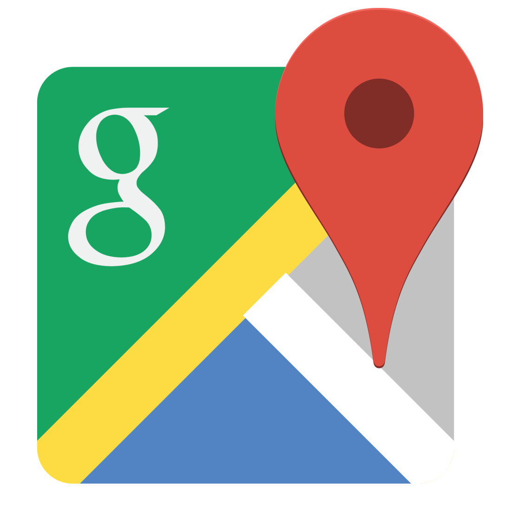

# CampBnB

 

---

## Link to Live Site

[CampBnB Site](https://aa-campbnb.herokuapp.com/)

---

 

## Description

CampBnB is based off of AirBnB for users to list their spots or make bookings at existing spots on the platform. Users may also choose to leave a rating or review at any of the existing spots.

 

## Technologies

 

  
  &nbsp;
  
  &nbsp;
  
  &nbsp;
  
  &nbsp;
  
  &nbsp;
  
  &nbsp;
  
  &nbsp;
  
  &nbsp;
  
  &nbsp;
  
  &nbsp;
  
  &nbsp;
  
  &nbsp;
  

 
 

## Getting Started

 

1.  Clone this repository:
            
         HTTPS: https://github.com/willkee/CampBnB.git
         
         or
         
         SSH: git@github.com:willkee/CampBnB.git

     

2.  Install dependencies from the root directory.

         npm install

     

3.  Create a user on PostgreSQL (psql) with a `PASSWORD` and `CREATEDB` privileges.

        CREATE USER <username> WITH PASSWORD <password> CREATEDB;

     

4.  In the backend directory, create a `.env` file based on the `.env.example` file.
     

5.  Enter your username and password into the respective fields in the `.env` file you just created. Enter your chosen database name and `PORT`. You may enter a secure combination of characters into `JWT_SECRET` or use the following in `node` in your terminal to generate a secure string. You may use `localhost` for `DB_HOST`. You may also need to set up Google Maps API credentials [here](https://developers.google.com/maps/documentation/embed/get-api-key) to obtain an API key for the `MAPS_API_KEY`.

        require("crypto").randomBytes(32).toString("hex")

     

6.  Add a number to `JWT_EXPIRES_IN`. By default, you may use `604500`.

 

7.  Ensure the following proxy code is found in your package.json file in the `frontend` directory. If you chose any port other than `5000`, replace the port number.

        "proxy": "http://localhost:5000"

     

8.  Run the following code in your backend directory to run the creation of the database and migrations as well as to seed the database.

        npx dotenv sequelize db:create
        npx dotenv sequelize db:migrate
        npx dotenv sequelize db:seed:all

     

9.  Start the backend and frontend servers in their respective directories. Your browser should open the application automatically. If not, navigate to `http://localhost:3000` in your browser.

        npm start

     

10. You may use the demo user or sign up as a new user to take advantage of the features of the application.

 

 

## Features

- There will be a splash page welcoming users to the site, with options to log in, sign up, log in as a demo user, or browse the site unauthenticated.
- The homepage will display a grid of spots already on the platform.
- Unauthenticated users may view (but not add) spots and associated reviews and ratings.
- Authenticated users may post a new spot, or a review/rating for an existing spot.

 

## Screenshots

